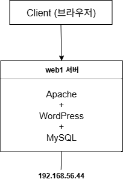
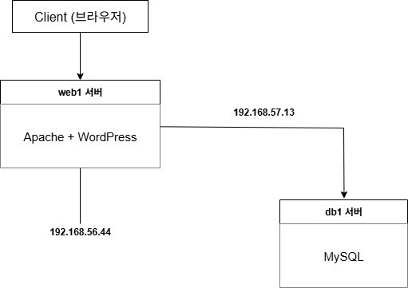
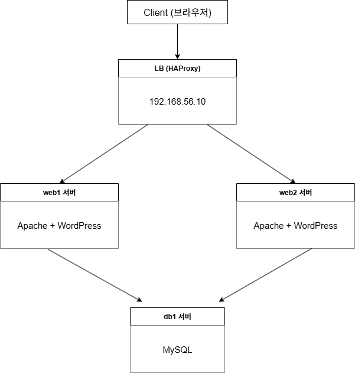
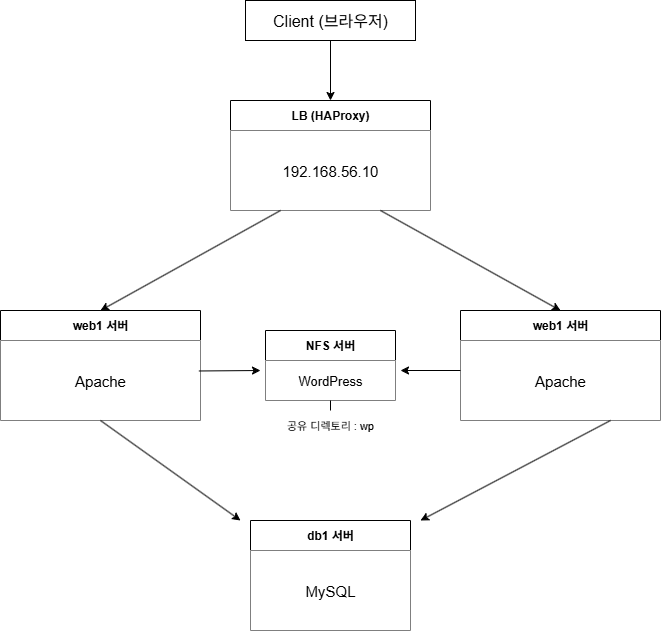
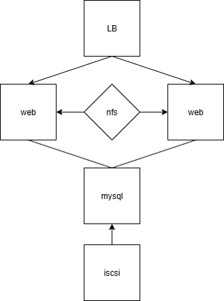
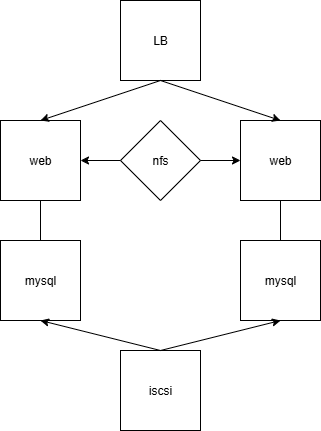

# 미니 프로젝트
<br><br>


## 초기 vagrant 파일
```
# -*- mode: ruby -*-
# vi: set ft=ruby :
vm_image = "nobreak-labs/rocky-9"
vm_subnet = "192.168."

Vagrant.configure("2") do |config|
  config.vm.synced_folder ".", "/vagrant", disabled: true

  config.vm.define "web1" do |node|
    node.vm.box = vm_image
    node.vm.provider "virtualbox" do |vb|
      vb.name = "web1"
      vb.cpus = 2
      vb.memory = 2048
    end

    node.vm.network "private_network", ip: vm_subnet + "56.44", nic_type: "virtio"
    node.vm.network "private_network", ip: vm_subnet + "57.44", nic_type: "virtio"
    node.vm.hostname = "web1"
  end

  config.vm.define "web2" do |node|
    node.vm.box = vm_image
    node.vm.provider "virtualbox" do |vb|
      vb.name = "web2"
      vb.cpus = 2
      vb.memory = 2048
    end

    node.vm.network "private_network", ip: vm_subnet + "56.45", nic_type: "virtio"
    node.vm.network "private_network", ip: vm_subnet + "57.45", nic_type: "virtio"
    node.vm.hostname = "web2"
  end
end
```

<br><br>


---
# 1. HTTP, WP, MySQL 한 서버에서 연결
### web1로 진행

<br><br>


## 1-1. 기본 도구 설치
<br>

### 1) Apache 웹 서버(httpd) 설치
```
sudo yum install -y httpd
```
### 2) WordPress 최신 버전 압축 파일 다운로드
curl / -o 다운도르 시 저장할 이름 / 워드프레스 최신 버전 압축파일 다운로드 url
```
curl -o wordpress.tar.gz https://wordpress.org/latest.tar.gz
```
### 3) MySQL 클라이언트 설치
데이터베이스에 접속하고 쿼리를 날릴 수 있는 도구
```
sudo yum install -y mysql
```
### 4) MySQL-Server 설치
실제 데이터 저장과 쿼리 처리를 담당하는 DB 서버 프로그램
```
sudo yum install -y mysql-server
```
### 5) php 설치
워드 프레스는 PHP로 작성되어있어서 php를 설치가 필수
```
sudo yum install -y php
```
### 6) PHP-MySQLND
MySQL Native Driver를 기반으로하는 PHP 확장도구. PHP에서 MySQL 서버에 직접 연결할 수 있게 해줌
```
sudo yum install -y php-mysqlnd
```

### 7) 아파치 db 연결 설정
```
 sudo setsebool -P httpd_can_network_connect_db 1
 ```
<br><br>


## 1-2 Apache, WP 설정
<br>

### 1) Apache 웹 서버
웹 서버 시작 및 방화벽 허용
```
sudo systemctl start httpd
```
```
sudo systemctl enable httpd
```
```
sudo firewall-cmd --permanent --add-service=http
```
```
sudo firewall-cmd --reload
```
### 2) 워드프레스 압축해제
```
sudo tar xvf wordpress.tar.gz -C /var/www/html
```
```
ls /var/www/html # 확인용
```
### 3) 워드프레스 설정파일에서 db정보 입력
WordPress 압축을 해제하면 `wp-config-sample.php` 파일이 있
이를 복사해 실제 설정 파일인 `wp-config.php`로 만든 후, 아래와 같이 DB 정보를 입력
```
sudo cp /var/www/html/wordpress/wp-config-sample.php /var/www/html/wordpress/wp-config.php
```
```
sudo vi /var/www/html/wordpress/wp-config.php
```
```
// ** Database settings - You can get this info from your web host ** //
/** The name of the database for WordPress */
define( 'DB_NAME', 'wp' );

/** Database username */
define( 'DB_USER', 'wp-user' );

/** Database password */
define( 'DB_PASSWORD', 'P@ssw0rd' );

/** Database hostname */
define( 'DB_HOST', '192.168.56.44' );

/** Database charset to use in creating database tables. */
define( 'DB_CHARSET', 'utf8' );

/** The database collate type. Don't change this if in doubt. */
define( 'DB_COLLATE', '' );
```
### 4) 가상 호스트 설정
```
sudo vi /etc/httpd/conf.d/wordpress.conf
```
```
<VirtualHost *:80>
        ServerName example.com
        DocumentRoot    /var/www/html/wordpress

        <Directory      "/var/www/html/wordpress">
                AllowOverride All
        </Directory>

</Virtualhost>
```
### 5) 설정 적용
```
sudo systemctl restart httpd
```
<br><br>


## 1-3 db설정
<br>

### 1) MySQLD 시작
```
sudo systemctl start mysqld
```
### 2) mysql 안에 유저 데이터 삽입
```
sudo mysql
```
```
create database wp;
```
```
create user 'wp-user'@'192.168.56.44' identified by 'P@ssw0rd';
```
```
grant all privileges on wp.* to 'wp-user'@'192.168.56.44';
```
```
exit
```
<br><br>


## 1-4 테스트
<br>

### 1) curl로 확인
그냥 curl로 확인하면 아무 페이지도 로딩되지 않는다.<br>
http://192.168.56.44/  =>  http://192.168.56.44/wp-admin/install.php<br>
여기로 리다이렉션중이기 때문<br>
-I 옵션을 붙여서 Location 부분을 확인하면 된다.
```
curl -I http://192.168.56.44/
```
### 2) 웹 브라우저 접속
```
http://192.168.56.44/
```
<br><br><br><br><br><br>


---
# 2. MySQL을 다른 서버로 분리

<br><br>


## 2-1 원래 서버에 있던 MySQL삭제 및 새로운 db서버 설치 
### db 서버는 db1 사용
<br>

### 1) 새로운 db서버 init파일
```
# -*- mode: ruby -*-
# vi: set ft=ruby :
vm_image = "nobreak-labs/rocky-9"
vm_subnet = "192.168."

Vagrant.configure("2") do |config|
  config.vm.synced_folder ".", "/vagrant", disabled: true

  config.vm.define "db1" do |node|
    node.vm.box = vm_image
    node.vm.provider "virtualbox" do |vb|
      vb.name = "db1"
      vb.cpus = 2
      vb.memory = 2048
    end

    node.vm.network "private_network", ip: vm_subnet + "57.13", nic_type: "virtio"
    node.vm.network "private_network", ip: vm_subnet + "56.13", nic_type: "virtio"
    node.vm.hostname = "db1"
  end

  config.vm.define "db2" do |node|
    node.vm.box = vm_image
    node.vm.provider "virtualbox" do |vb|
      vb.name = "db2"
      vb.cpus = 2
      vb.memory = 2048
    end

    node.vm.network "private_network", ip: vm_subnet + "57.14", nic_type: "virtio"
    node.vm.network "private_network", ip: vm_subnet + "56.14", nic_type: "virtio"
    node.vm.hostname = "db2"
  end
end

```
### 2) 기존 서버 db삭제 
### ** 웹 서버에서 진행 **
```
sudo systemctl stop mysqld
```
```
sudo yum remove mysql mysql-server
```
<br><br>


## 2-2 새로운 db서버 MySQL설정 
### ** db서버에서 진행 **
<br>

### 1) MySQL, MySQL-Server 설치
데이터베이스에 접속하고 쿼리를 날릴 수 있는 도구
```
sudo yum install -y mysql mysql-server
```
### 2) MySQL 시작
```
sudo systemctl start mysqld
```
```
sudo systemctl enable mysqld
```
### 3) MySQL 안에 유저 데이터 삽입
```
sudo mysql
```
```
create database wp;
```
```
CREATE USER 'wp-user'@'192.168.57.44' IDENTIFIED BY 'P@ssw0rd';
```
```
GRANT ALL PRIVILEGES ON wp.* TO 'wp-user'@'192.168.57.44';
```

[왜 57.1로 나가는가?](#왜-571인가)

```
FLUSH PRIVILEGES;
```
```
exit
```
### 4) sql 방화벽 허용
```
sudo firewall-cmd --permanent --add-service=mysql
```
```
sudo firewall-cmd --reload
```
<br><br>


## 2-3 웹 서버 워드프레스 설정 
### ** 웹 서버에서 진행 **
<br>

### 1) 워드 프레스 설정 변경
```
sudo vi /var/www/html/wordpress/wp-config.php
```
```
// ** Database settings - You can get this info from your web host ** //
/** The name of the database for WordPress */
define( 'DB_NAME', 'wp' );

/** Database username */
define( 'DB_USER', 'wp-user' );

/** Database password */
define( 'DB_PASSWORD', 'P@ssw0rd' );

/** Database hostname */
define( 'DB_HOST', '192.168.57.13' );

/** Database charset to use in creating database tables. */
define( 'DB_CHARSET', 'utf8' );

/** The database collate type. Don't change this if in doubt. */
define( 'DB_COLLATE', '' );
```
<br><br>


## 2-4 테스트
<br>

### 1) curl로 확인
```
curl -I http://192.168.56.44/
```
### 2) 웹 브라우저 접속
```
http://192.168.56.44/
```
<br><br><br><br><br><br>


---
# 3. LoadBalancer 구현

vagrant파일
```
# -*- mode: ruby -*-
# vi: set ft=ruby :
vm_image = "nobreak-labs/rocky-9"
vm_subnet = "192.168."

Vagrant.configure("2") do |config|
  config.vm.synced_folder ".", "/vagrant", disabled: true

  config.vm.define "lb" do |node|
    node.vm.box = vm_image
    node.vm.provider "virtualbox" do |vb|
      vb.name = "lb"
      vb.cpus = 2
      vb.memory = 2048
    end

    node.vm.network "private_network", ip: vm_subnet + "56.10", nic_type: "virtio"
    node.vm.hostname = "lb"
  end
end
```
<br><br>


## 3-1. 로드밸런서 설치
<br>

HAProxy와 Nginx가 있다.
HAProxy로 할 예정
```
sudo yum install -y haproxy
```
<br><br>


## 3-2. 로드밸런서 설정
<br>

```
sudo vi /etc/haproxy/haproxy.cfg
```
밑 내용 추가
```
frontend http_front
    bind *:80
    default_backend http_back

backend http_back
    balance roundrobin
    server web1 192.168.56.44:80 check
    server web2 192.168.56.45:80 check

# HAProxy Stats Page 설정
listen stats
    bind *:8404
    stats enable
    stats uri /stats
    stats refresh 10s
    stats realm Haproxy\ Statistics
    stats auth admin:admin  # 사용자명:비밀번호

```
<br><br>


## 3-3. HAProxy Stats Page 포트 추가
<br>

```
sudo semanage port -a -t http_port_t -p tcp 8404
```
```
sudo firewall-cmd --permanent --add-port=8404/tcp
```
```
sudo firewall-cmd --reload
```
<br><br>


## 3-4. 포트 80으로 방화벽 열어주기
<br>

```
sudo firewall-cmd --permanent --add-port=80/tcp
```
```
sudo firewall-cmd --reload
```
<br><br>


## 3-5. 로드밸런서 서비스 시작
<br>

```
sudo systemctl enable haproxy
```
```
sudo systemctl start haproxy
```
<br><br>


## 3-6. 웹서버 (web2 설정)
<br>

### 1) Apache 웹 서버(httpd) 설치
```
sudo yum install -y httpd
```
### 2) WordPress 최신 버전 압축 파일 다운로드
curl / -o 다운도르 시 저장할 이름 / 워드프레스 최신 버전 압축파일 다운로드 url
```
curl -o wordpress.tar.gz https://wordpress.org/latest.tar.gz
```
### 3) php, PHP-MySQLND 설치
워드 프레스는 PHP로 작성되어있어서 php를 설치가 필수
```
sudo yum install -y php php-mysqlnd
```
### 4) Apache 웹 서버
웹 서버 시작 및 방화벽 허용
웹 서버 시작 및 방화벽 허용
```
sudo systemctl start httpd
```
```
sudo systemctl enable httpd
```
```
sudo firewall-cmd --permanent --add-service=http
```
```
sudo firewall-cmd --reload
```
### 5) 워드프레스 압축해제
```
sudo tar xvf wordpress.tar.gz -C /var/www/html
```
```
ls /var/www/html # 확인용
```
### 6) 워드프레스 설정파일에서 db정보 입력
WordPress 압축을 해제하면 `wp-config-sample.php` 파일이 있
이를 복사해 실제 설정 파일인 `wp-config.php`로 만든 후, 아래와 같이 DB 정보를 입력
```
sudo cp /var/www/html/wordpress/wp-config-sample.php /var/www/html/wordpress/wp-config.php
```
```
sudo vi /var/www/html/wordpress/wp-config.php
```
```
// ** Database settings - You can get this info from your web host ** //
/** The name of the database for WordPress */
define( 'DB_NAME', 'wp' );

/** Database username */
define( 'DB_USER', 'wp-user' );

/** Database password */
define( 'DB_PASSWORD', 'P@ssw0rd' );

/** Database hostname */
define( 'DB_HOST', '192.168.57.13' );

/** Database charset to use in creating database tables. */
define( 'DB_CHARSET', 'utf8' );

/** The database collate type. Don't change this if in doubt. */
define( 'DB_COLLATE', '' );
```
### 7) 가상 호스트 설정
```
sudo vi /etc/httpd/conf.d/wordpress.conf
```
```
<VirtualHost *:80>
        ServerName example.com
        DocumentRoot    /var/www/html/wordpress

        <Directory      "/var/www/html/wordpress">
                AllowOverride All
        </Directory>

</Virtualhost>
```
### 8) 설정 적용
```
sudo systemctl restart httpd
```
### 9) sebool http와 db 연결 설정
```
sudo setsebool -P httpd_can_network_connect_db 1
```
<br><br>


## 3-7. HAProxy 작동 확인
<br>

### 1) HAProxy Stats Page 주소 (HAProxy 정보 페이지)
아이디 비번은 상단 로드밸런서 설정에 적혀있는 아이디 비번이다.(admin/admin)
```
http://192.168.56.10:8404/stats
```
### 2) 테스트
현재 web2는 db서버에 유저를 추가하지 않아서 web1는 제대로 뜨고 web2는 "Error establishing a database connection"이 뜰것이다.<br>
접속해서 새로고침을 연속으로 누를 시, web1,web2가 번갈아가며 뜨는지 확인<br>
궁금하면 web1, web2도 들어가서 새로고침 연타<br>
**LB(로드밸런서)**
```
http://192.168.56.10
```
**web1**
```
http://192.168.56.44/
```
**web2**
```
http://192.168.56.45/
```

### 3) MySQL 안에 web2 유저 데이터 삽입
### ** db서버에서 진행 **
```
sudo mysql
```
```
CREATE USER 'wp-user'@'192.168.57.45' IDENTIFIED BY 'P@ssw0rd';
```
```
GRANT ALL PRIVILEGES ON wp.* TO 'wp-user'@'192.168.57.45';
```
### 4) 테스트
이제 제대로 뜰거임
```
http://192.168.56.10
```
<br><br><br><br><br><br>


---
# 4. NFS 추가

웹 서버 2개와 연결할것임.

자동이랑 수동이 있는데 자동으로 할것임임

vagrant 파일
```
# -*- mode: ruby -*-
# vi: set ft=ruby :
vm_image = "nobreak-labs/rocky-9"
vm_subnet = "192.168."

Vagrant.configure("2") do |config|
  config.vm.synced_folder ".", "/vagrant", disabled: true

  config.vm.define "nfs" do |node|
    node.vm.box = vm_image
    node.vm.provider "virtualbox" do |vb|
      vb.name = "nfs"
      vb.cpus = 2
      vb.memory = 2048
    end

    node.vm.network "private_network", ip: vm_subnet + "56.46", nic_type: "virtio"
    node.vm.hostname = "nfs"
  end
end

```
<br><br>


## 4-1. nfs 서버 설정
<br><br>


### 1) NFS-utils 설치
```
sudo dnf install nfs-utils -y
```

### 2) 공유폴더 생성
```
sudo mkdir -p /wp
```

### 3) 권한 설정
```
sudo chown -R nobody:nobody /wp
```
```
sudo chmod -R 755 /wp
```

### 4) /etc/exports 설정
```
sudo vi /etc/exports
```
```
/wp 192.168.56.0/24(rw,sync,no_root_squash,no_subtree_check)
```
옵션 설명<br>
**rw** : 읽기/쓰기 가능<br>
**sync** : 요청 즉시 디스크에 기록<br>
**no_root_squash** : 클라이언트의 root 권한 유지 (WordPress 설치나 퍼미션 문제 피하려면 필요할 수 있음)<br>
**no_subtree_check** : 성능 및 안정성 개선

### 5) NFS 서비스 시작 및 자동 실행 설정
```
sudo systemctl enable --now nfs-server
```

### 6) 방화벽 설정
```
sudo firewall-cmd --permanent --add-service=nfs
```
```
sudo firewall-cmd --permanent --add-service=mountd
```
```
sudo firewall-cmd --permanent --add-service=rpc-bind
```
```
sudo firewall-cmd --reload
```

### 7) 확인
디렉토리 목록과 상세설정이 출력됨
```
sudo exportfs -v
```
<br><br>


## 4-2. 웹 서버 설정
<br>

### 1) autofs 설치
```
sudo yum install -y autofs
```
### 2) autofs 설정
```
sudo vi /etc/auto.master.d/nfs.autofs
```
```
/nfs    /etc/auto.nfs
```
```
sudo vi /etc/auto.nfs
```
```
wp -rw,sync 192.168.56.46:/wp
```
```
sudo mkdir /nfs
```
```
sudo systemctl enable autofs
```
```
sudo systemctl start autofs
```
### 3) 디렉터리가 공유되는지 확인
```
ls /nfs/wp
```
<br><br>


## 4-3. 워드프레스 설정 수정
<br>

### 1) 버츄얼호스트 수정
```
sudo vi /etc/httpd/conf.d/wordpress.conf
```
```
DocumentRoot "/nfs/wp/wordpress"
<VirtualHost *:80>
        ServerName example.com
        DocumentRoot "/nfs/wp/wordpress"

        <Directory      "/nfs/wp/wordpress">
                AllowOverride All
                Require all granted
        </Directory>

    ErrorLog logs/wordpress-error.log
    CustomLog logs/wordpress-access.log combined
</Virtualhost>
```

### 2) 원래 wordpress폴더 삭제
```
sudo rm -rf /var/www/html/wordpress
```

### 3) nfs http 연결권한 수정
```
sudo setsebool -P httpd_use_nfs on
```

### 4) 설정파일 확인 및 적용
```
sudo apachectl configtest
```
**결과는 다음과 같다.**
```
[vagrant@web1 ~]$ sudo apachectl configtest
AH00558: httpd: Could not reliably determine the server's fully qualified domain name, using 127.0.1.1. Set the 'ServerName' directive globally to suppress this message # 이거는 그냥 경고 메세지이다.
Syntax OK
```
```
sudo systemctl restart httpd
```
<br><br>


## 4-4. 여기는 web1이나 web2 둘중 아무데나에서 한번만 해주면 됨
<br>

### 1) 워드프레스 압축해제
```
sudo tar xvf wordpress.tar.gz -C /nfs/wp
```
```
ls /nfs/wp # 확인용
```

### 2) 워드프레스 db연결 설정
```
sudo cp /nfs/wp/wordpress/wp-config-sample.php /nfs/wp/wordpress/wp-config.php
```
```
sudo vi /nfs/wp/wordpress/wp-config.php
```
```
// ** Database settings - You can get this info from your web host ** //
/** The name of the database for WordPress */
define( 'DB_NAME', 'wp' );

/** Database username */
define( 'DB_USER', 'wp-user' );

/** Database password */
define( 'DB_PASSWORD', 'P@ssw0rd' );

/** Database hostname */
define( 'DB_HOST', '192.168.57.13' );

/** Database charset to use in creating database tables. */
define( 'DB_CHARSET', 'utf8' );

/** The database collate type. Don't change this if in doubt. */
define( 'DB_COLLATE', '' );
```

### 3) 테스트
```
http://192.168.56.10
```
<br><br><br><br><br><br>


---
# 5. 데이터베이스 iscsi 연결

**vagrant파일**
```
# -*- mode: ruby -*-
# vi: set ft=ruby :
vm_image = "nobreak-labs/rocky-9"
vm_subnet = "192.168."

Vagrant.configure("2") do |config|
  config.vm.synced_folder ".", "/vagrant", disabled: true

  config.vm.define "iscsi" do |node|
    node.vm.box = vm_image
    node.vm.provider "virtualbox" do |vb|
      vb.name = "iscsi"
      vb.cpus = 2
      vb.memory = 2048
    end

    node.vm.network "private_network", ip: vm_subnet + "57.15", nic_type: "virtio"
    node.vm.hostname = "iscsi"
  end
end
```
<br><br>


## 5-1. 
<br><br>
5. 데이터베이스 iSCSI 연결 (Vagrant 환경 기준)

이 단계는 iscsi VM을 iSCSI Target (디스크를 제공하는 서버)으로, db1 VM을 iSCSI Initiator (디스크를 사용하는 클라이언트)로 설정하는 것입니다.5-1. iSCSI Target 서버 구성 (iscsi VM에서 진행)

iscsi VM에 접속하여 iSCSI Target (LIO)을 설정합니다. MySQL 데이터가 저장될 10GB 크기의 논리 볼륨을 생성하고 이를 iSCSI로 외부에 노출합니다.
필요 패키지 설치:

sudo dnf install -y targetcli
데이터 저장용 디스크 준비:

가상 머신에 추가된 디스크 (예: /dev/sdb 또는 vdb)를 사용합니다. 여기서는 10GB 크기의 이미지를 만들어서 사용하는 것으로 가정합니다. 실제 운영 환경에서는 별도의 물리/가상 디스크를 LVM 등으로 구성하는 것이 좋습니다.

sudo mkdir -p /iscsi_data
sudo dd if=/dev/zero of=/iscsi_data/mysql_disk.img bs=1M count=10240 # 10GB 이미지 파일 생성
targetcli를 사용하여 iSCSI Target 설정:

sudo targetclitargetcli 쉘에서 다음 명령어를 순서대로 입력합니다.

# 백엔드 스토어 생성 (여기서는 이미지 파일 사용)
/backstores/fileio create mysql_file /iscsi_data/mysql_disk.img

# iSCSI Target 생성
/iscsi create iqn.2025-08.com.example:mysql.target

# TPG(Target Portal Group) 및 LUN(Logical Unit Number) 설정
# 위에서 생성한 백엔드 스토어를 LUN으로 연결
/iscsi/iqn.2025-08.com.example:mysql.target/tpg1/luns create /backstores/fileio/mysql_file

# ACL(Access Control List) 설정: db1 VM의 iSCSI Initiator IQN을 허용
# 이 부분은 'db1' VM에서 'InitiatorName'을 확인한 후 정확한 값으로 대체해야 합니다.
# 일단 임시로 "iqn.1993-08.org.debian:01:db1-client"와 같이 입력하고, db1에서 확인 후 다시 수정할 수 있습니다.
# 또는 테스트를 위해 "AUTHENTICATION_DISABLED"를 사용하여 ACL을 비활성화할 수도 있습니다 (보안상 권장되지 않음).
/iscsi/iqn.2025-08.com.example:mysql.target/tpg1/acls create iqn.1993-08.org.debian:01:db1-client # db1 VM의 실제 InitiatorName으로 대체

# 포털 설정: iSCSI Target 서버의 IP (iscsi VM의 192.168.57.15)
/iscsi/iqn.2025-08.com.example:mysql.target/tpg1/portals create 192.168.57.15

# 설정 저장 및 종료
saveconfig
exit
방화벽 설정:

iSCSI 기본 포트(3260/tcp)를 허용합니다.

sudo firewall-cmd --permanent --add-port=3260/tcp
sudo firewall-cmd --reload
iSCSI Target 서비스 시작 및 자동 실행:

sudo systemctl enable --now target
5-2. iSCSI Initiator 클라이언트 구성 (db1 VM에서 진행)

db1 VM에 접속하여 iSCSI Initiator를 설정하고, iscsi VM이 제공하는 디스크를 연결하고 마운트합니다.
필요 패키지 설치:

sudo yum install -y iscsi-initiator-utils
iSCSI Initiator Name 확인:

이 값은 위 iscsi VM의 targetcli에서 ACL 설정 시 사용됩니다.

cat /etc/iscsi/initiatorname.iscsi
# 출력 예시: InitiatorName=iqn.1993-08.org.debian:01:db1-client (이 값을 iscsi VM의 ACL에 추가해야 함)주의: 만약 iscsi VM에서 targetcli의 ACL 설정을 이 값으로 하지 않았다면, iscsi VM으로 돌아가 targetcli에서 acls를 수정하고 saveconfig를 다시 해야 합니다.
iSCSI Target 디스커버리:

iscsi VM의 IP 주소로 iSCSI Target을 검색합니다.

sudo iscsiadm -m discovery -t st -p 192.168.57.15명령어 실행 후, iqn.2025-08.com.example:mysql.target 와 같은 Target IQN이 출력되는지 확인합니다.
iSCSI Target에 로그인:

디스커버리된 Target에 로그인하여 디스크를 연결합니다.

sudo iscsiadm -m node -l로그인 성공 시, /dev/sdX (X는 a, b, c 등) 형태의 새 블록 디바이스가 생성됩니다. sudo fdisk -l 명령어로 확인해볼 수 있습니다.
새 디스크 포맷 및 마운트:

새로 연결된 iSCSI 디스크를 포맷하고 MySQL 데이터 디렉토리에 마운트합니다.

(새로운 디스크 장치가 /dev/sdb로 할당되었다고 가정합니다. 실제 장치명은 다를 수 있으니 fdisk -l 등으로 확인하세요.)

sudo mkfs.ext4 /dev/sdb # 또는 다른 파일 시스템 (xfs 등)
sudo mkdir -p /var/lib/mysql_data # MySQL 데이터가 저장될 새로운 경로
sudo mount /dev/sdb /var/lib/mysql_data
/etc/fstab에 추가 (재부팅 시 자동 마운트):

재부팅 후에도 자동으로 마운트되도록 /etc/fstab에 추가합니다. _netdev 옵션은 네트워크 장치가 활성화된 후 마운트되도록 합니다.

/etc/fstab 파일을 열고 다음 줄을 추가합니다.

# UUID를 사용하여 안정적인 마운트 권장 (UUID는 blkid 명령어로 확인)
# sudo blkid /dev/sdb
# 예: UUID="YOUR_DISK_UUID" /var/lib/mysql_data ext4 _netdev,defaults 0 0
/dev/sdb /var/lib/mysql_data ext4 _netdev,defaults 0 0추가 후 sudo mount -a 명령어로 오류가 없는지 확인합니다.
MySQL 데이터 경로 변경:

MySQL의 기본 데이터 저장 경로를 iSCSI로 마운트된 /var/lib/mysql_data로 변경해야 합니다.


6. 데이터베이스 이중화
   


---
---
## 왜 57.1인가?
[root@server ~]# telnet 192.168.57.13 3306
Connected to 192.168.57.13.
Escape character is '^]'.
EHost '192.168.57.1' is not allowed to connect to this MySQL serverConnection closed by foreign host.

웹 서버는 192.168.57.1로 접속을 시도하고있다.

[root@server ~]# ip route get 192.168.57.13
192.168.57.13 via 10.0.2.2 dev enp0s3 src 10.0.2.15 uid 0
    cache

ip route get 192.168.57.13 결과를 보면,

192.168.57.13 via 10.0.2.2 dev enp0s3 src 10.0.2.15 uid 0
이 뜻은:

192.168.57.13 (DB서버)로 가는 경로가

게이트웨이 10.0.2.2를 통해

enp0s3 인터페이스로 나가고

출발지 IP는 10.0.2.15로 설정된다는 것

즉, 웹서버에서 DB서버로 가는 트래픽이 **10.0.2.0/24 네트워크(호스트 전용 네트워크)**를 거치고 있습니다.

이게 의미하는 점
웹서버에서 DB서버로 연결 시도할 때 실제 출발 IP가 192.168.56.44가 아니라
10.0.2.15 혹은 192.168.57.1 같은 가상 네트워크 IP로 변환되어 MySQL에 도달합니다.

따라서 MySQL에서 허용하는 IP도 10.0.2.15 또는 192.168.57.1 같은 IP로 등록해야 정상 연결 가능.

즉, **enp0s3 (NAT 네트워크)** 를 통해 나가므로 출발 IP는 10.0.2.15

그런데 접속 로그엔 왜 192.168.57.1이라고 보일까?
그건 다음과 같은 경우입니다:

🔍 현재 상황의 원인 요약
1. 웹서버 IP: 192.168.56.44
이는 enp0s8 등 호스트 전용 네트워크 어댑터에 연결된 주소입니다.

이 NIC는 56대역 (예: 192.168.56.0/24)에 속해 있음.

2. DB서버 IP: 192.168.57.13
enp0s8 또는 enp0s9에 설정된 주소이며, 57대역 (192.168.57.0/24)에 있음.

DB서버 입장에서 보면 56대역 NIC가 없음!

그래서 56 네트워크로부터 직접 패킷을 받을 방법이 없음.

📌 그래서 어떤 일이 일어나냐면?
🛣 경로 흐름 (추론):
웹서버 (192.168.56.44) → DB서버 (192.168.57.13)로 통신 시도

VirtualBox의 호스트 머신(Windows)이 두 네트워크 모두에 속함

56대역: 192.168.56.1

57대역: 192.168.57.1

그래서 실제 경로는 이렇게 됨:

scss
복사
편집
웹서버 → VirtualBox 호스트 (56.1) → VirtualBox 호스트 (57.1) → DB서버 (57.13)
이 때 DB서버에서 보면 접속 출발지는 192.168.57.1 (호스트) 으로 보임

즉, 웹서버 IP가 아니고, 중간 릴레이인 호스트의 IP

🎯 결론: DB서버에 56대역 NIC가 없다 보니
VirtualBox가 알아서 호스트 머신을 릴레이처럼 사용함

그 결과 DB서버에서 **실제 요청 IP는 192.168.57.1**로 보임

이건 NAT처럼 동작하는 셈
